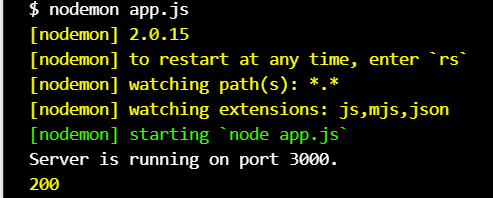

# Weather Project

We've going to learn all aspects of Weather API in use, including:

- authentication;
- paths;
- queries;

And we've going to parse the JSON data, we'll get back and send it over to the browser using Express and Node modules.

